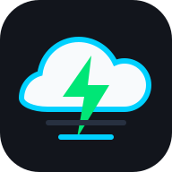
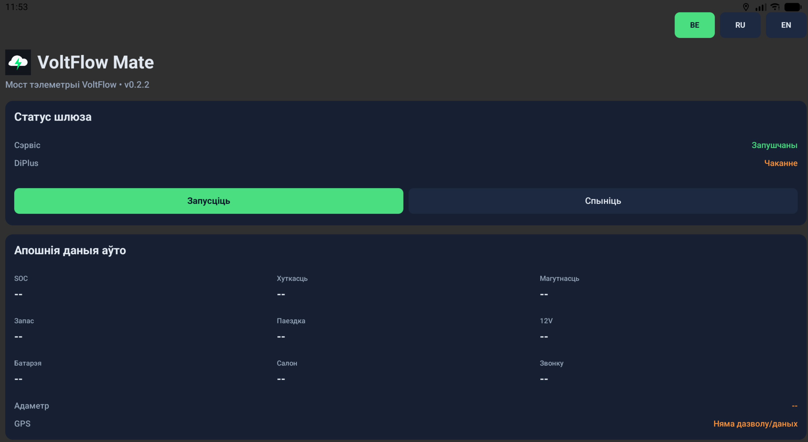
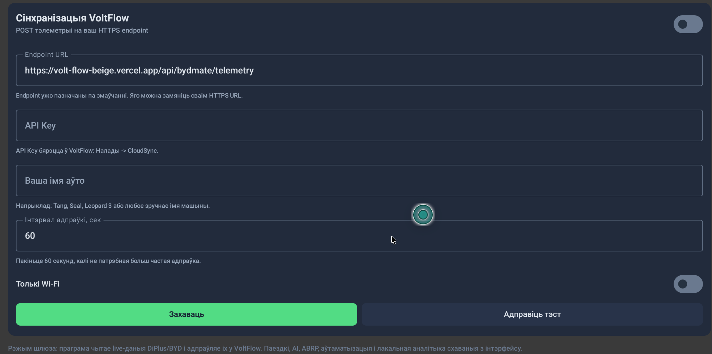

<div align="center">



# VoltFlow Mate

### Локальная телеметрия, поездки, зарядки и автоматизация для BYD DiLink

[](https://developer.android.com)
[](https://kotlinlang.org)
[](https://developer.android.com/jetpack/compose)
[](LICENSE)
[](https://github.com/scroodge/BYDMate-own/releases/latest)

**VoltFlow Mate** — форк BYDMate для головных устройств BYD DiLink. Приложение читает live-данные напрямую из системного BYD `autoservice` через on-device ADB и передаёт их в облако VoltFlow.

[Скачать APK](https://github.com/scroodge/BYDMate-own/releases) ·[Сборка из исходников](#-сборка-из-исходников) · [Поддержать](SUPPORT.md)

</div>

---

## Что умеет

| Иконка | Раздел | Что делает |
|---|---|---|
|  | Передаёт телеметрию в VoltFlow | Читает live-данные напрямую из BYD `autoservice` через on-device ADB. История поездок для совместимых машин импортируется из `energydata`. |
| 📡 | Работает на стоянке | Опциональный shell-демон сохраняет direct-телеметрию и wake/sleep-survival после выключения машины; для него нужен разовый on-device ADB. |
| ⬆️ | Обновления APK | Проверка GitHub Releases при запуске, диалог, скачивание и установка (экран шлюза → **Обновления**). |


Приложение использует отдельный Android `applicationId`: `dev.scroodge.cloudevmate`. Поэтому оно может стоять рядом с оригинальным BYDMate (`com.bydmate.app`) и не заменяет его.

---

## Быстрая установка

Самый простой путь — поставить готовый APK из GitHub Releases.

1. Откройте [последний релиз](https://github.com/scroodge/BYDMate-own/releases/latest).
2. Скачайте файл `VoltFlow-Mate-v...apk`.
3. Перенесите APK на головное устройство DiLink через USB-флешку, браузер, файловый менеджер web телеграмм, или ADB.
4. Откройте APK на DiLink и разрешите установку из неизвестных источников.
5. После запуска выдайте разрешения на геолокацию, хранилище и отображение поверх других приложений.
6. В DiLink выключите ограничение фоновой работы для VoltFlow Mate: **Settings -> General -> Disable background Apps -> VoltFlow Mate = OFF**. Если забыли — приложение само это заметит: на экране шлюза появится оранжевое предупреждение с кнопкой, которая открывает нужный экран DiLink. Предупреждение исчезает сразу после отключения ограничения.

Следующие версии можно ставить поверх: на экране шлюза включите **Проверять обновления** — при запуске приложение предложит скачать новый APK с [GitHub Releases](https://github.com/scroodge/BYDMate-own/releases/latest), если он новее установленного.

### Что ещё нужно установить

VoltFlow Mate **не требует di+ (D+)**. Для live-данных включите беспроводной ADB в инженерном
меню DiLink и один раз подтвердите ключ приложения — после этого APK читает проверенные FID
напрямую из системного BYD `autoservice`.

1. В инженерном меню включите **Wireless ADB debug switch**.
2. В VoltFlow Mate откройте расширенные функции, нажмите **Connect ADB** и подтвердите диалог на DiLink.
3. Проверьте live-данные на экране шлюза (SOC, мощность, состояние зарядки, 12 V).

> Оригинальное приложение [BYDMate](https://github.com/AndyShaman/BYDMate) и di+ устанавливать
> **не нужно**. VoltFlow Mate читает BYD `autoservice` самостоятельно через разово настроенный on-device ADB.


## Первый запуск

1. Откройте VoltFlow Mate.
2. Выдайте разрешения на локацию и хранилище.
3. Нажмите кнопку "Запустить" и убедитесь что данные запускаются.
4. Зарегестрируйтесь в VoltFlow по этой ссылке (https://github.com/scroodge/VoltFlow/blob/main/INSTALL.md)
5. В VoltFlow откройте **Настройки → VoltFlow Mate** и нажмите **Подключить BYDMate** — появится 6-значный код (действует 10 минут).
6. В **VoltFlow Mate** (экран шлюза или Настройки → Cloud Sync) введите код и нажмите **Подключить**. Полный API key не нужен; в **Дополнительно** — ручная вставка ключа для отладки.
7. Укажите имя авто (должно совпадать с `vehicle_id` в облаке, например `way`), нажмите **Send test**, затем **Save** и включите синхронизацию.
8. Убедитесь, что в веб-приложении VoltFlow в разделе **Авто** появляются live-данные при включённой машине.

### Подключение к VoltFlow (кратко)

| Где | Действие |
|-----|----------|
| VoltFlow (телефон/браузер) | **Настройки → VoltFlow Mate → Подключить BYDMate** → 6 цифр, 10 минут |
| VoltFlow Mate (DiLink) | **Код из VoltFlow** → **Подключить** → имя авто → **Send test** → **Save** |
| Уже настроенные установки | Старый вставленный API key продолжает работать; переподключение нужно только после **Generate key** в VoltFlow или очистки данных приложения |

Контракт API: [VoltFlow `supabase/BYDMATE_APK_API.md`](https://github.com/scroodge/VoltFlow/blob/main/supabase/BYDMATE_APK_API.md) (или ваш fork EvAcChargeTimer). Детали wire format: [docs/cloud-telemetry-contract-ru.md](docs/cloud-telemetry-contract-ru.md).

### Расширенные функции (опционально) — всё без компьютера

Для **базовой live-телеметрии** (пока машина включена, а приложение и D+ работают) хватает шагов выше. Дополнительно ничего настраивать не нужно — источник данных всегда D+ (выбора провайдера keep-alive больше нет).

Если хотите **удалённые команды, телеметрию при выключенной машине, чтение SoH и автовосстановление демона после перезагрузки** — нужен разовый on-device ADB. **Компьютер не требуется**, всё делается на планшете. В приложении на экране шлюза есть карточка **«Расширенные функции»** — она ведёт по шагам:

1. **Включите беспроводной ADB на DiLink** через инженерное меню → **TestTools → «Wireless adb debug switch»**. Это одноразовая процедура на самом планшете (без ПК); подробности — кнопка **«Открыть инструкцию»** в карточке или [docs/guides/dilink5-adb-activation-ru.pdf](docs/guides/dilink5-adb-activation-ru.pdf).
2. Нажмите в карточке **«Подключить ADB»** и подтвердите системный диалог **«Allow USB debugging?»** прямо на экране. Тот же ключ используется для автозапуска D+, SoH/autoservice и демона выживания.
3. Кнопкой **«Сеть на стоянке»** откройте сетевые настройки и включите **«Keep network on while parked»** (иначе Wi-Fi отключается через ~9 минут после стоянки и демон теряет связь с облаком).

Карточка сама показывает статус ADB (**Подключён / Не настроен**) и исчезает из «требует действий», когда всё готово. Без ADB расширенные функции просто не активируются — приложение продолжает слать обычную live-телеметрию.

> **Почему нельзя «совсем только APK» (без инженерного меню):** удалённые команды и работа при выключенной машине требуют прав уровня shell. На незарутованном DiLink единственный путь к ним — on-device ADB. Termux и Shizuku **не** обходят этот платформенный замок BYD: им самим нужен такой же разовый ADB/root-бутстрап. Но повторимся — сам анлок делается **на планшете, без компьютера**.

Подробности про демон: [docs/REMOTE_COMMAND_DAEMON.md](docs/REMOTE_COMMAND_DAEMON.md).

---

## Скриншоты

### VoltFlow Mate на планшетном экране






## Сборка из исходников

Этот путь нужен разработчикам и тем, кто хочет собрать APK самостоятельно.

### Требования

- JDK 17.
- Android SDK Platform 34.
- Android Gradle Plugin из проекта.
- Доступ к интернету при первом запуске Gradle, чтобы скачать зависимости.
- macOS, Linux или Windows с установленным Android SDK.

### Команды

```bash
git clone https://github.com/scroodge/BYDMate-own.git
cd BYDMate-own
./gradlew clean assembleDebug
```

Готовый debug APK появится здесь:

```text
app/build/outputs/apk/debug/VoltFlow-Mate-v<version>.apk
```

Debug-сборка подписывается стандартным debug-ключом Android и подходит для личной установки через ADB или файловый менеджер DiLink.

### Выпуск обновления

Проект распространяет и обновляет **только debug APK**. Перед публикацией используйте:

```bash
./gradlew testDebugUnitTest assembleDebug
```

Опубликуйте `app/build/outputs/apk/debug/VoltFlow-Mate-v<version>.apk` в GitHub Release с русским
описанием изменений. Затем установите именно этот файл на DiLink и убедитесь, что после установки
в VoltFlow появились свежие `bydmate_telemetry_samples` и `bydmate_live_snapshots`. Успешная сборка
и установка без свежей телеметрии не считаются успешным выпуском.

Автопроверка обновлений смотрит на
`https://api.github.com/repos/scroodge/BYDMate-own/releases/latest` и выбирает первый `.apk` в
assets последнего релиза.

---

## Стек

- Kotlin, Jetpack Compose, Material 3.
- Room, Hilt, OkHttp, Coroutines/Flow.
- osmdroid / OpenStreetMap.
- WorkManager для фоновой работы.
- Min SDK 29, Target SDK 29, Compile SDK 34.

---

## Документация

| Файл | Содержание |
|------|------------|
| [docs/cloud-telemetry-contract-ru.md](docs/cloud-telemetry-contract-ru.md) | HTTPS ingest, заголовки, cadence, GPS privacy, **6-значное подключение** |
| [docs/REMOTE_COMMAND_DAEMON.md](docs/REMOTE_COMMAND_DAEMON.md) | Удалённые команды при **выключенной машине**: демон выживания, установка, обновление, автозапуск |
| [docs/EV_PRO_APP_ANALYSIS.md](docs/EV_PRO_APP_ANALYSIS.md) | Реверс-инжиниринг конкурента (BYD EV Pro): прямой доступ к `autoservice` в обход di+, watchdog вместо демон-хака |
| [docs/project-notes.md](docs/project-notes.md) | Заметки разработчика (vehicle_id, VoltFlow, Cloud Sync) |
| VoltFlow `supabase/BYDMATE_APK_API.md` | Серверный контракт: telemetry, `link-code`, `redeem` |
| VoltFlow `supabase/TELEMETRY.md` | Схема БД и pairing на стороне облака |

---

## Поддержка и вклад

- Ошибки и предложения: [GitHub Issues](https://github.com/scroodge/BYDMate-own/issues).
- История изменений: [CHANGELOG.md](CHANGELOG.md).
- Поддержать проект: [SUPPORT.md](SUPPORT.md).

При баг-репорте укажите модель BYD, версию DiLink, источник данных поездок и что уже пробовали.

---

## Благодарности

- [BYDMate](https://github.com/AndyShaman/BYDMate) — оригинальное GPLv3-приложение, на котором основан проект.
- DiPlus / D+ — локальный мост к данным автомобиля.

---

## Лицензия

GPLv3 с условиями атрибуции. Подробности: [LICENSE](LICENSE) и [NOTICE.md](NOTICE.md).

Copyright (C) 2026 [Scroodge](https://github.com/scroodge/)
